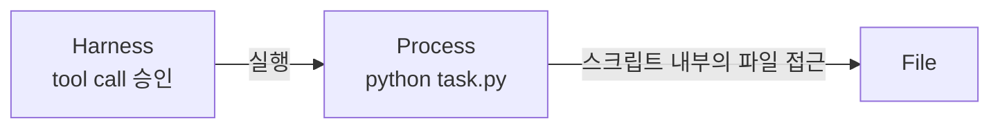
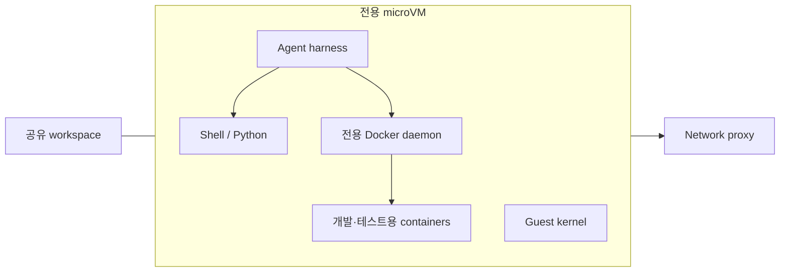
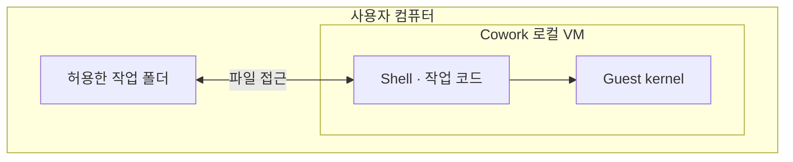
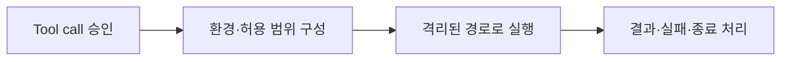
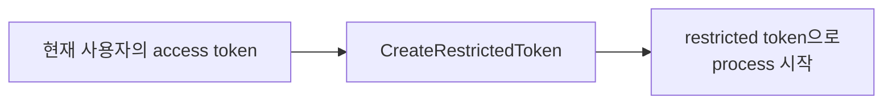

<div class="eyebrow">INSIDE THE SANDBOX</div>

# Coding agent는 Sandbox를<br>어떻게 구축할까?

격리 경계의 선택부터<br>실행 환경 구성과 Agent 연동까지

---
title: Tool call에서 자원 접근까지
---
<div class="eyebrow">01 / AGENT × OS</div>

# Tool call에서 자원 접근까지

<svg viewBox="0 0 920 370" role="img" aria-label="User space의 Model, Agent harness, Sandbox runtime, Command process와 그 아래 Kernel space로 이어지는 접근 요청" style="width: 100%; height: auto;">
  <defs>
    <marker id="flow-arrow" viewBox="0 0 10 10" refX="9" refY="5" markerWidth="7" markerHeight="7" orient="auto-start-reverse"><path d="M 0 0 L 10 5 L 0 10 z" fill="#64776c" /></marker>
  </defs>
  <g font-family="Noto Sans CJK KR, Malgun Gothic, sans-serif" font-size="16" fill="#202d28">
    <rect x="2" y="2" width="916" height="160" fill="#f5f3eb" stroke="#64776c" stroke-width="2" />
    <text style="font-size: 16px;" x="22" y="30" font-weight="600">User space</text>
    <g fill="#e7eee6" stroke="#48745e">
      <rect x="24" y="66" width="110" height="62" />
      <rect x="228" y="66" width="160" height="62" />
      <rect x="492" y="66" width="180" height="62" />
    </g>
    <rect x="742" y="66" width="154" height="62" fill="#faf0e4" stroke="#a76a34" />
    <g text-anchor="middle">
      <text style="font-size: 16px;" x="79" y="103">Model</text>
      <text style="font-size: 16px;" x="308" y="103">Agent harness</text>
      <text style="font-size: 16px;" x="582" y="103">Sandbox runtime</text>
      <text style="font-size: 16px;" x="819" y="92">Command process</text>
      <text style="font-size: 16px;" x="819" y="115" font-size="14">shell · tools</text>
    </g>
    <g fill="none" stroke="#64776c" stroke-width="1.5" marker-end="url(#flow-arrow)">
      <path d="M134 97 H228" />
      <path d="M388 97 H492" />
      <path d="M672 97 H742" />
    </g>
    <g text-anchor="middle" font-size="14">
      <text style="font-size: 16px;" x="181" y="85">tool call</text>
      <text style="font-size: 16px;" x="440" y="85">실행 요청</text>
      <text style="font-size: 16px;" x="707" y="85">Launch</text>
    </g>
    <rect x="2" y="266" width="916" height="102" fill="#e8eef5" stroke="#315f85" stroke-width="2" />
    <text style="font-size: 16px;" x="22" y="294" font-weight="600">Kernel space</text>
    <text style="font-size: 16px;" x="460" y="310" text-anchor="middle">OS kernel · access-control mechanisms</text>
    <g fill="none" stroke="#64776c" stroke-width="1.5" marker-end="url(#flow-arrow)">
      <path d="M582 128 V266" />
      <path d="M780 128 V266" />
    </g>
    <g font-size="14">
      <text style="font-size: 16px;" x="568" y="205" text-anchor="end">OS API: 제한 설정</text>
      <text style="font-size: 16px;" x="766" y="199" text-anchor="end">syscall</text>
      <text style="font-size: 16px;" x="766" y="220" text-anchor="end">자원 접근 요청</text>
    </g>
    <g>
      <rect x="225" y="63" width="166" height="68" fill="none" stroke="#245b47" stroke-width="3" />
      <text style="font-size: 15px;" x="308" y="151" text-anchor="middle" fill="#245b47" font-weight="600">Approval · 이 명령을 실행해도 되는가?</text>
    </g>
    <g>
      <rect x="2" y="266" width="916" height="102" fill="none" stroke="#315f85" stroke-width="3" />
      <text style="font-size: 17px;" x="460" y="347" text-anchor="middle" fill="#315f85" font-weight="600">Enforcement · 허용된 접근 범위를 강제</text>
    </g>
  </g>
</svg>

<div class="sources"><a href="https://learn.chatgpt.com/docs/sandboxing">Codex sandboxing</a> · <a href="https://github.com/anthropics/sandbox-runtime">Anthropic Sandbox Runtime</a></div>

---
title: Harness의 Approval 처리
---
<div class="eyebrow">02 / HARNESS · APPROVAL</div>

# Harness는 tool을 호출하기 전에 정책을 확인한다

<div class="flex justify-center">

```mermaid {scale: 0.90, flowchart: {nodeSpacing: 22, rankSpacing: 32, padding: 14}}
flowchart LR
    C["Model의 tool call<br>Bash: python task.py"] -->|요청| H{"Harness<br>정책 평가"}
    P["Permission rules · 예<br>git status → Allow<br>python * → Ask<br>rm * → Deny"] -->|규칙| H
    M["Permission mode"] -->|모드| H
    H -->|Allow| T["Tool executor<br>명령 실행 경로로 전달"]
    H -->|Ask| U["Approval UI<br>사용자에게 확인"]
    H -->|Deny| R["Tool result<br>거부 사유를 Model에 반환"]
    U -->|승인| T
    U -->|거부| R
    style P fill:#faf0e4,stroke:#a76a34
    style M fill:#faf0e4,stroke:#a76a34
    style C fill:#e7eee6,stroke:#48745e
```

</div>

<div class="sources">Claude Code의 기본적인 규칙 기반 흐름을 단순화한 예. 규칙은 설명용이며 제품 기본값이 아님. <a href="https://code.claude.com/docs/en/permissions">Permissions</a> · <a href="https://code.claude.com/docs/en/agent-sdk/user-input">Approval 처리</a></div>

---
title: 호출 승인과 실행 환경의 격리
---
<div class="eyebrow">03 / APPROVAL → SANDBOX</div>

# 호출 승인과 실행 환경의 격리는 다르다

<div class="flex justify-center">



</div>

<div class="mt-4"><strong>요구사항: workspace에만 쓰기</strong></div>

| Process가 시도한 작업 | 원하는 결과 |
| --- | --- |
| `write(workspace/result)` | Allow |
| `write(protected/config)` | Deny |

<div class="callout mt-3"><strong>Sandbox</strong>: 코드가 허가된 자원에만 접근하도록 격리·통제하는 실행 환경.</div>

<div class="sources">그림은 tool 실행 승인만 적용한 경우. 표는 파일 접근 제한에 대한 가상 요구사항. <a href="https://csrc.nist.gov/glossary/term/Sandbox">NIST: Sandbox</a> · <a href="https://chromium.googlesource.com/chromium/src/+/main/docs/design/sandbox.md">Chromium: Sandbox design</a></div>

---
title: Process 직접 제한과 Container 및 VM 기반 격리
---
<div class="eyebrow">04 / ISOLATION BOUNDARIES</div>

# 무엇을 공유하고, 무엇을 분리하는가?

<svg viewBox="0 0 960 360" role="img" aria-label="Process 직접 제한과 Container 기반 격리는 host kernel을 사용하며 VM 기반 격리는 각각 guest kernel을 갖는다" style="width:100%;height:auto">
<defs><marker id="boundary-arrow" viewBox="0 0 10 10" refX="9" refY="5" markerWidth="7" markerHeight="7" orient="auto"><path d="M0 0 L10 5 L0 10z" fill="#64776c" /></marker></defs>
<text x="160" y="25" text-anchor="middle" style="font-size:19px;font-weight:600;fill:#202d28">Process에 직접 제한</text>
<rect x="10" y="53" width="142" height="177" fill="#f5f3eb" stroke="#64776c" stroke-width="2" />
<text x="81" y="77" text-anchor="middle" style="font-size:15px;font-weight:600;fill:#202d28">권한 제한</text>
<rect x="22" y="94" width="118" height="48" fill="#e7eee6" stroke="#48745e" stroke-width="2" />
<text x="81" y="123" text-anchor="middle" style="font-size:16px;font-weight:400;fill:#202d28">Process A</text>
<text x="81" y="183" text-anchor="middle" style="font-size:15px;font-weight:400;fill:#202d28">Host 환경 사용</text>
<path d="M81 230 V258" fill="none" stroke="#64776c" stroke-width="1.5" marker-end="url(#boundary-arrow)" />
<rect x="164" y="53" width="142" height="177" fill="#f5f3eb" stroke="#64776c" stroke-width="2" />
<text x="235" y="77" text-anchor="middle" style="font-size:15px;font-weight:600;fill:#202d28">권한 제한</text>
<rect x="176" y="94" width="118" height="48" fill="#e7eee6" stroke="#48745e" stroke-width="2" />
<text x="235" y="123" text-anchor="middle" style="font-size:16px;font-weight:400;fill:#202d28">Process B</text>
<text x="235" y="183" text-anchor="middle" style="font-size:15px;font-weight:400;fill:#202d28">Host 환경 사용</text>
<path d="M235 230 V258" fill="none" stroke="#64776c" stroke-width="1.5" marker-end="url(#boundary-arrow)" />
<rect x="10" y="260" width="616" height="50" fill="#e8eef5" stroke="#315f85" stroke-width="2" />
<text x="318" y="291" text-anchor="middle" style="font-size:18px;font-weight:600;fill:#202d28">Host kernel</text>
<text x="480" y="25" text-anchor="middle" style="font-size:19px;font-weight:600;fill:#202d28">Container 기반 격리</text>
<rect x="330" y="53" width="142" height="177" fill="#f5f3eb" stroke="#64776c" stroke-width="2" />
<text x="401" y="77" text-anchor="middle" style="font-size:15px;font-weight:600;fill:#202d28">Container</text>
<rect x="342" y="94" width="118" height="48" fill="#e7eee6" stroke="#48745e" stroke-width="2" />
<text x="401" y="113" text-anchor="middle" style="font-size:14px;fill:#202d28">Agent harness</text>
<text x="401" y="132" text-anchor="middle" style="font-size:14px;fill:#202d28">Shell / Python</text>
<rect x="342" y="162" width="118" height="48" fill="#faf0e4" stroke="#a76a34" stroke-width="2" />
<text x="401" y="191" text-anchor="middle" style="font-size:14px;font-weight:400;fill:#202d28">Root filesystem</text>
<path d="M401 230 V258" fill="none" stroke="#64776c" stroke-width="1.5" marker-end="url(#boundary-arrow)" />
<rect x="484" y="53" width="142" height="177" fill="#f5f3eb" stroke="#64776c" stroke-width="2" />
<text x="555" y="77" text-anchor="middle" style="font-size:15px;font-weight:600;fill:#202d28">Container</text>
<rect x="496" y="94" width="118" height="48" fill="#e7eee6" stroke="#48745e" stroke-width="2" />
<text x="555" y="113" text-anchor="middle" style="font-size:14px;fill:#202d28">Agent harness</text>
<text x="555" y="132" text-anchor="middle" style="font-size:14px;fill:#202d28">Shell / Python</text>
<rect x="496" y="162" width="118" height="48" fill="#faf0e4" stroke="#a76a34" stroke-width="2" />
<text x="555" y="191" text-anchor="middle" style="font-size:14px;font-weight:400;fill:#202d28">Root filesystem</text>
<path d="M555 230 V258" fill="none" stroke="#64776c" stroke-width="1.5" marker-end="url(#boundary-arrow)" />
<text x="800" y="25" text-anchor="middle" style="font-size:19px;font-weight:600;fill:#202d28">VM 기반 격리</text>
<text x="800" y="45" text-anchor="middle" style="font-size:13px;fill:#64776c">microVM 포함</text>
<rect x="650" y="53" width="142" height="177" fill="#f5f3eb" stroke="#64776c" stroke-width="2" />
<text x="721" y="77" text-anchor="middle" style="font-size:15px;font-weight:600;fill:#202d28">VM</text>
<rect x="662" y="94" width="118" height="48" fill="#e7eee6" stroke="#48745e" stroke-width="2" />
<text x="721" y="113" text-anchor="middle" style="font-size:14px;fill:#202d28">Agent harness</text>
<text x="721" y="132" text-anchor="middle" style="font-size:14px;fill:#202d28">Shell / Python</text>
<rect x="662" y="162" width="118" height="48" fill="#e8eef5" stroke="#315f85" stroke-width="2" />
<text x="721" y="191" text-anchor="middle" style="font-size:15px;font-weight:400;fill:#202d28">Guest kernel</text>
<path d="M721 230 V258" fill="none" stroke="#64776c" stroke-width="1.5" marker-end="url(#boundary-arrow)" />
<rect x="804" y="53" width="142" height="177" fill="#f5f3eb" stroke="#64776c" stroke-width="2" />
<text x="875" y="77" text-anchor="middle" style="font-size:15px;font-weight:600;fill:#202d28">VM</text>
<rect x="816" y="94" width="118" height="48" fill="#e7eee6" stroke="#48745e" stroke-width="2" />
<text x="875" y="113" text-anchor="middle" style="font-size:14px;fill:#202d28">Agent harness</text>
<text x="875" y="132" text-anchor="middle" style="font-size:14px;fill:#202d28">Shell / Python</text>
<rect x="816" y="162" width="118" height="48" fill="#e8eef5" stroke="#315f85" stroke-width="2" />
<text x="875" y="191" text-anchor="middle" style="font-size:15px;font-weight:400;fill:#202d28">Guest kernel</text>
<path d="M875 230 V258" fill="none" stroke="#64776c" stroke-width="1.5" marker-end="url(#boundary-arrow)" />
<rect x="650" y="260" width="296" height="50" fill="#e8eef5" stroke="#315f85" stroke-width="2" />
<text x="798" y="291" text-anchor="middle" style="font-size:18px;font-weight:600;fill:#202d28">가상화 계층</text>
<text x="160" y="344" text-anchor="middle" style="font-size:16px;font-weight:600;fill:#245b47">기존 도구를 그대로 활용</text>
<text x="480" y="344" text-anchor="middle" style="font-size:16px;font-weight:600;fill:#245b47">의존성을 묶어 환경 재현</text>
<text x="800" y="344" text-anchor="middle" style="font-size:16px;font-weight:600;fill:#245b47">Guest kernel까지 분리</text>
</svg>

<div class="sources">대표 구조를 단순화. Container·VM에는 Agent 전체를 넣는 실행 사례를 표시. Container는 일반 Linux container 기준. 가상화 계층은 VMM과 플랫폼 가상화 기능을 묶어 표시. <a href="https://docs.docker.com/engine/security/">Container security</a> · <a href="https://docs.docker.com/ai/sandboxes/security/isolation/">microVM isolation</a> · <a href="https://chromium.googlesource.com/chromium/src/+/main/docs/design/sandbox.md">Process 격리</a> · <a href="https://learn.microsoft.com/en-us/virtualization/hyper-v-on-windows/reference/hyper-v-architecture">Hyper-V</a> · <a href="https://docs.kernel.org/virt/kvm/api.html">KVM</a></div>

---
title: Runtime의 명령 실행 환경 설정
---
<div class="eyebrow">05 / TOOL EXECUTION</div>

# Runtime이 명령 실행 환경을 설정한다

<svg viewBox="0 0 940 355" role="img" aria-label="실행 전 Harness가 Runtime에 명령과 설정을 전달한다. Runtime은 파일 접근 규칙, 네트워크 연결 경로, 환경변수를 설정한다. 실행 중에는 파일 접근 제어와 네트워크 접근 제어가 적용된다." style="width:100%;height:330px">
<defs><marker id="prepare-enforce" viewBox="0 0 10 10" refX="9" refY="5" markerWidth="7" markerHeight="7" orient="auto"><path d="M0 0 L10 5 L0 10z" fill="#64776c" /></marker></defs>
<text x="10" y="24" style="font-size:22px;font-weight:600;fill:#202d28">실행 전 준비</text>
<text x="500" y="24" style="font-size:22px;font-weight:600;fill:#202d28">명령 실행 중</text>
<rect x="10" y="60" width="120" height="50" fill="#e7eee6" stroke="#48745e" />
<text x="70" y="91" text-anchor="middle" style="font-size:19px;fill:#202d28">Harness</text>
<path d="M130 85 H237" fill="none" stroke="#64776c" stroke-width="1.5" marker-end="url(#prepare-enforce)" />
<text x="184" y="72" text-anchor="middle" style="font-size:16px;fill:#64776c">명령·설정</text>
<rect x="240" y="60" width="200" height="50" fill="#e7eee6" stroke="#48745e" />
<text x="340" y="91" text-anchor="middle" style="font-size:19px;fill:#202d28">Runtime / helper</text>
<path d="M340 110 V128 H25 V316" fill="none" stroke="#64776c" stroke-width="1.5" />
<path d="M25 176 H57" fill="none" stroke="#64776c" stroke-width="1.5" marker-end="url(#prepare-enforce)" />
<path d="M25 246 H57" fill="none" stroke="#64776c" stroke-width="1.5" marker-end="url(#prepare-enforce)" />
<path d="M25 316 H57" fill="none" stroke="#64776c" stroke-width="1.5" marker-end="url(#prepare-enforce)" />
<rect x="60" y="146" width="380" height="60" fill="#f5f3eb" stroke="#64776c" />
<text x="77" y="171" style="font-size:18px;font-weight:600;fill:#245b47">Filesystem</text>
<text x="77" y="195" style="font-size:18px;fill:#202d28">OS의 파일 접근 규칙 설정</text>
<rect x="60" y="216" width="380" height="60" fill="#f5f3eb" stroke="#64776c" />
<text x="77" y="241" style="font-size:18px;font-weight:600;fill:#245b47">Network</text>
<text x="77" y="265" style="font-size:18px;fill:#202d28">허용할 네트워크 연결 경로 설정</text>
<rect x="60" y="286" width="380" height="60" fill="#f5f3eb" stroke="#64776c" />
<text x="77" y="311" style="font-size:18px;font-weight:600;fill:#245b47">환경변수</text>
<text x="77" y="335" style="font-size:18px;fill:#202d28">명령에 전달할 이름·값 구성</text>
<rect x="535" y="60" width="365" height="110" fill="#e7eee6" stroke="#48745e" stroke-width="2" />
<text x="717" y="91" text-anchor="middle" style="font-size:21px;font-weight:600;fill:#202d28">Shell → python task.py</text>
<rect x="553" y="110" width="329" height="43" fill="#f5f3eb" stroke="#64776c" />
<text x="717" y="137" text-anchor="middle" style="font-size:18px;fill:#202d28">전달받은 환경변수</text>
<path d="M625 170 V247" fill="none" stroke="#64776c" stroke-width="1.5" marker-end="url(#prepare-enforce)" />
<path d="M812 170 V247" fill="none" stroke="#64776c" stroke-width="1.5" marker-end="url(#prepare-enforce)" />
<text x="610" y="217" text-anchor="end" style="font-size:17px;fill:#64776c">파일 접근</text>
<text x="827" y="217" style="font-size:17px;fill:#64776c">네트워크 연결</text>
<rect x="500" y="250" width="220" height="80" fill="#e8eef5" stroke="#315f85" />
<text x="610" y="281" text-anchor="middle" style="font-size:19px;fill:#202d28">파일 접근 제어</text>
<text x="610" y="311" text-anchor="middle" style="font-size:17px;fill:#64776c">파일별 접근 허용 / 거부</text>
<rect x="742" y="250" width="188" height="80" fill="#e8eef5" stroke="#315f85" />
<text x="836" y="281" text-anchor="middle" style="font-size:19px;fill:#202d28">네트워크 접근 제어</text>
<text x="836" y="311" text-anchor="middle" style="font-size:17px;fill:#64776c">연결 허용 / 거부</text>
</svg>

<div class="sources">실행 환경을 구성하는 개념도. 파일·네트워크 접근 제어의 구현은 뒤에서 설명한다. <a href="https://github.com/anthropics/sandbox-runtime">Runtime의 설정·실행 구조</a></div>

---
title: 작업별 실행 환경 구성
---
<div class="eyebrow">06 / CONFIGURE</div>

# Harness는 Sandbox에 필요한 설정을 지정한다

<div class="comparison-slide">

| 대상 | Harness가 전달할 정보 | 실제 적용 |
| --- | --- | --- |
| Filesystem | 도구 경로: Read<br>workspace 경로: Read / Write | 파일 권한·mount 등으로<br>접근 범위 제한 |
| Network | 연결할 registry의<br>도메인·포트 | Proxy·네트워크 필터로<br>연결 제한 |
| 환경변수 | `PATH` 등 이름·값<br>전달할 인증 정보 | Process 시작 시<br>지정한 환경변수만 전달 |

</div>

<div class="sources">설정 항목과 적용 방식의 공통 예시. 구체적인 방식은 구현별로 다르다. <a href="https://github.com/anthropics/sandbox-runtime">Runtime API·설정 파일</a> · <a href="https://docs.docker.com/engine/containers/run/">실행 옵션</a> · <a href="https://nodejs.org/api/child_process.html#child_processspawncommand-args-options">Process 생성의 env 인자</a></div>

---
layout: two-cols-header
title: Windows의 Access token과 DACL
---
<div class="eyebrow">07 / DIRECT · WINDOWS</div>

# Windows: Process의 신원과 파일의 접근 규칙

::left::

## 누가 요청하는가?

<div>

Process의 **Access token** — 신원·권한 정보

| 정보 | 의미 |
| --- | --- |
| User SID | 사용자의 보안 식별자 |
| Group SID | 소속 그룹의 식별자 |
| Privileges | 특정 시스템 작업을 수행하는 특권 |

</div>

::right::

## 어떤 접근을 허용하는가?

<div>

파일의 **DACL** — 접근 규칙(ACE)의 목록

| 각 규칙의 정보 | 의미 |
| --- | --- |
| Target SID | 어느 사용자·그룹에 |
| Allow / Deny | 허용할지, 거부할지 |
| Access rights | Read·Write 등 어떤 접근을 |

</div>

<div class="sources">OS가 관리하는 token 정보와 파일에 저장된 접근 규칙의 주요 항목. <a href="https://learn.microsoft.com/en-us/windows/win32/secauthz/access-tokens">Access tokens</a> · <a href="https://learn.microsoft.com/en-us/windows/win32/secauthz/how-dacls-control-access-to-an-object">Microsoft: AccessCheck</a> · <a href="https://learn.microsoft.com/en-us/windows/win32/secauthz/restricted-tokens">Restricted Tokens</a></div>

---
title: Token과 파일 권한으로 명령의 접근 제한
---
<div class="eyebrow">08 / DIRECT · WINDOWS</div>

# Windows: 명령의 신원과 파일 권한으로 접근을 제한한다

<svg viewBox="-10 -35 920 380" role="img" aria-label="Harness는 원래 사용자 token으로 실행되며 Runtime에 설정을 전달한다. Runtime은 명령을 sandbox-user의 token으로 실행하고 workspace의 DACL에 해당 사용자의 쓰기를 허용한다. Windows kernel이 명령의 token과 파일의 DACL을 대조한다." style="width:100%;height:300px">
<defs><marker id="identity-rule" viewBox="0 0 10 10" refX="9" refY="5" markerWidth="7" markerHeight="7" orient="auto"><path d="M0 0 L10 5 L0 10z" fill="#64776c" /></marker></defs>
<path d="M0 -30 H900 V82 H420 V264 H0 Z" fill="#faf9f5" stroke="#c9d1c9" />
<text x="18" y="-10" style="font-size:15px;fill:#64776c">User space</text>
<rect x="10" y="4" width="245" height="65" fill="#e7eee6" stroke="#48745e" />
<text x="132" y="30" text-anchor="middle" style="font-size:20px;font-weight:600;fill:#202d28">Agent harness</text>
<text x="132" y="54" text-anchor="middle" style="font-size:17px;fill:#64776c">원래 사용자의 token</text>
<rect x="420" y="4" width="270" height="65" fill="#e7eee6" stroke="#48745e" />
<text x="555" y="43" text-anchor="middle" style="font-size:20px;font-weight:600;fill:#202d28">Sandbox runtime / helper</text>
<path d="M255 37 H417" fill="none" stroke="#64776c" stroke-width="1.5" marker-end="url(#identity-rule)" />
<text x="336" y="25" text-anchor="middle" style="font-size:16px;fill:#64776c">명령·허용 범위</text>
<path d="M470 69 V91 H102 V133" fill="none" stroke="#64776c" stroke-width="1.5" marker-end="url(#identity-rule)" />
<text x="117" y="120" style="font-size:16px;fill:#245b47">전용 사용자로 실행</text>
<path d="M620 69 V91 H695 V133" fill="none" stroke="#64776c" stroke-width="1.5" marker-end="url(#identity-rule)" />
<text x="710" y="120" style="font-size:16px;fill:#245b47">Workspace의 DACL 설정</text>
<rect x="10" y="137" width="185" height="115" fill="#f5f3eb" stroke="#64776c" stroke-width="2" />
<text x="102.5" y="162" text-anchor="middle" style="font-size:17px;font-weight:600;fill:#202d28">부모 Process · Shell</text>
<rect x="20" y="174" width="165" height="66" fill="#e7eee6" stroke="#48745e" />
<text x="32" y="195" style="font-size:17px;fill:#245b47">Access token</text>
<text x="32" y="215" style="font-size:15px;fill:#202d28">User SID:</text>
<text x="32" y="233" style="font-size:15px;fill:#202d28">sandbox-user의 ID</text>
<rect x="225" y="137" width="185" height="115" fill="#f5f3eb" stroke="#64776c" stroke-width="2" />
<text x="317.5" y="162" text-anchor="middle" style="font-size:17px;font-weight:600;fill:#202d28">자식 Process · Python</text>
<rect x="235" y="174" width="165" height="66" fill="#e7eee6" stroke="#48745e" />
<text x="247" y="195" style="font-size:17px;fill:#245b47">Access token</text>
<text x="247" y="215" style="font-size:15px;fill:#202d28">User SID:</text>
<text x="247" y="233" style="font-size:15px;fill:#202d28">sandbox-user의 ID</text>
<path d="M195 194 H222" fill="none" stroke="#64776c" stroke-width="1.5" marker-end="url(#identity-rule)" />
<rect x="500" y="137" width="390" height="115" fill="#f5f3eb" stroke="#64776c" stroke-width="2" />
<text x="518" y="165" style="font-size:20px;font-weight:600;fill:#202d28">DACL · 파일의 접근 규칙</text>
<text x="518" y="197" style="font-size:18px;fill:#245b47">Workspace: sandbox-user에 쓰기 허용</text>
<text x="518" y="227" style="font-size:18px;fill:#202d28">보호된 파일: 해당 신원에 쓰기 허용 없음</text>
<path d="M102 252 V283" fill="none" stroke="#64776c" stroke-width="1.5" marker-end="url(#identity-rule)" />
<path d="M317 252 V283" fill="none" stroke="#64776c" stroke-width="1.5" marker-end="url(#identity-rule)" />
<path d="M695 252 V283" fill="none" stroke="#64776c" stroke-width="1.5" marker-end="url(#identity-rule)" />
<rect x="10" y="287" width="880" height="43" fill="#e8eef5" stroke="#315f85" stroke-width="2" />
<text x="450" y="315" text-anchor="middle" style="font-size:18px;fill:#202d28">Kernel space · Windows · Token의 SID와 DACL을 대조해 파일 쓰기 허용 / 거부</text>
</svg>

<div class="small mt-3">지원 조건: 전용 계정·파일 권한을 설정할 권한 필요</div>

<div class="sources">전용 사용자 방식의 단순화된 예. 필요한 권한을 가진 Runtime / helper가 설정한다. 일반적인 자식 생성에서 신원이 이어지는 예. 보호된 파일은 그룹·상속 등을 통한 쓰기 허용도 없는 경우. <a href="https://learn.microsoft.com/en-us/windows/win32/secauthz/access-tokens">Token</a> · <a href="https://learn.microsoft.com/en-us/windows/win32/secauthz/how-dacls-control-access-to-an-object">DACL</a> · <a href="https://learn.microsoft.com/en-us/windows/win32/procthread/creating-processes">Process 생성</a></div>

---
title: Linux의 Namespaces와 seccomp 및 Landlock
---
<div class="eyebrow">09 / DIRECT · LINUX</div>

# Linux: 실행할 Process에 제한을 추가한다

<div class="small mb-4">UID·GID에 따른 파일 권한을 바꾸기보다, Process 수준에서 실행 환경과 동작을 제어한다.</div>

<div class="grid grid-cols-3 gap-6 linux-concepts">
<div>

## 어떤 자원이 보이는가?

**Namespaces**

Process가 보는 자원 공간을 분리

| 종류 | 분리하는 것 |
| --- | --- |
| Mount | mount 목록 |
| Network | Network 장치·통신 환경 |
| PID | Process ID 공간 |

</div>
<div>

## 어떤 호출을 허용하는가?

**seccomp**

System call을 필터링

| 정보 | 의미 |
| --- | --- |
| 호출 번호 | 어떤 system call인지 |
| 인자 값 | 어떤 옵션으로 호출했는지 |
| 처리 | 호출 허용·오류 반환 등 |

</div>
<div>

## 어떤 접근을 허용하는가?

**Landlock**

**Process 한정**의 추가 접근 제한

| 정보 | 의미 |
| --- | --- |
| 대상 | 접근할 파일·디렉터리 |
| 권한 | Read·Write 등 허용 동작 |
| 적용 범위 | 자신과 자식 Process |

</div>
</div>

<div class="sources">주요 항목을 단순화. Landlock은 파일 접근 예로 설명. ABI는 사용 가능한 기능의 버전이며 상세 조건은 부록 C 참고. <a href="https://man7.org/linux/man-pages/man7/namespaces.7.html">Namespaces</a> · <a href="https://docs.kernel.org/userspace-api/seccomp_filter.html">seccomp</a> · <a href="https://docs.kernel.org/userspace-api/landlock.html">Landlock</a></div>

---
title: Linux에서 명령 실행 환경 구성
---
<div class="eyebrow">10 / DIRECT · LINUX</div>

# Linux: 명령에 격리 환경과 접근 규칙을 적용한다

<svg viewBox="-10 -35 920 415" role="img" aria-label="Harness가 Runtime에 명령과 허용 범위를 전달한다. Runtime은 namespaces와 mount를 구성하고 seccomp와 Landlock 규칙을 적용한 뒤 Shell을 실행한다. 자식 Python도 같은 환경과 제한을 이어받고 Linux kernel이 검사한다." style="width:100%;height:330px">
<defs><marker id="linux-rule" viewBox="0 0 10 10" refX="9" refY="5" markerWidth="7" markerHeight="7" orient="auto"><path d="M0 0 L10 5 L0 10z" fill="#64776c" /></marker></defs>
<path d="M0 -30 H900 V82 H480 V304 H0 Z" fill="#faf9f5" stroke="#c9d1c9" />
<text x="18" y="-10" style="font-size:15px;fill:#64776c">User space</text>
<rect x="10" y="4" width="245" height="65" fill="#e7eee6" stroke="#48745e" />
<text x="132" y="30" text-anchor="middle" style="font-size:20px;font-weight:600;fill:#202d28">Agent harness</text>
<text x="132" y="54" text-anchor="middle" style="font-size:17px;fill:#64776c">원래 Host 환경</text>
<rect x="420" y="4" width="270" height="65" fill="#e7eee6" stroke="#48745e" />
<text x="555" y="43" text-anchor="middle" style="font-size:18px;font-weight:600;fill:#202d28">Sandbox runtime / launcher</text>
<path d="M255 37 H417" fill="none" stroke="#64776c" stroke-width="1.5" marker-end="url(#linux-rule)" />
<text x="336" y="25" text-anchor="middle" style="font-size:16px;fill:#64776c">명령·허용 범위</text>
<path d="M470 69 V91 H130 V133" fill="none" stroke="#64776c" stroke-width="1.5" marker-end="url(#linux-rule)" />
<text x="145" y="120" style="font-size:16px;fill:#245b47">Namespaces·mount 구성 후 실행</text>
<path d="M620 69 V91 H700 V133" fill="none" stroke="#64776c" stroke-width="1.5" marker-end="url(#linux-rule)" />
<text x="715" y="120" style="font-size:16px;fill:#245b47">Process에 규칙 적용</text>
<rect x="10" y="137" width="460" height="155" fill="#f5f3eb" stroke="#64776c" stroke-width="2" />
<text x="28" y="165" style="font-size:20px;font-weight:600;fill:#202d28">분리된 Namespaces</text>
<rect x="30" y="183" width="180" height="61" fill="#e7eee6" stroke="#48745e" />
<text x="120" y="207" text-anchor="middle" style="font-size:17px;fill:#202d28">부모 Process</text>
<text x="120" y="232" text-anchor="middle" style="font-size:20px;font-weight:600;fill:#245b47">Shell</text>
<rect x="270" y="183" width="180" height="61" fill="#e7eee6" stroke="#48745e" />
<text x="360" y="207" text-anchor="middle" style="font-size:17px;fill:#202d28">자식 Process</text>
<text x="360" y="232" text-anchor="middle" style="font-size:20px;font-weight:600;fill:#245b47">Python</text>
<path d="M210 213 H267" fill="none" stroke="#64776c" stroke-width="1.5" marker-end="url(#linux-rule)" />
<text x="28" y="276" style="font-size:18px;fill:#202d28">도구·workspace mount / 분리된 network</text>
<rect x="530" y="137" width="360" height="155" fill="#f5f3eb" stroke="#64776c" stroke-width="2" />
<text x="548" y="165" style="font-size:20px;font-weight:600;fill:#202d28">Process에 적용한 접근 규칙</text>
<text x="548" y="200" style="font-size:18px;fill:#245b47">seccomp: ptrace 호출 차단</text>
<text x="548" y="235" style="font-size:18px;fill:#245b47">Landlock: workspace 아래만 쓰기 허용</text>
<text x="548" y="270" style="font-size:17px;fill:#64776c">자식 Process에도 제한 유지</text>
<path d="M120 292 V323" fill="none" stroke="#64776c" stroke-width="1.5" marker-end="url(#linux-rule)" />
<path d="M360 292 V323" fill="none" stroke="#64776c" stroke-width="1.5" marker-end="url(#linux-rule)" />
<path d="M710 292 V323" fill="none" stroke="#64776c" stroke-width="1.5" marker-end="url(#linux-rule)" />
<rect x="10" y="327" width="880" height="43" fill="#e8eef5" stroke="#315f85" stroke-width="2" />
<text x="450" y="355" text-anchor="middle" style="font-size:18px;fill:#202d28">Kernel space · Linux · 분리된 자원 공간과 Process의 규칙에 따라 접근 검사</text>
</svg>

<div class="sources">세 기능을 조합하는 개념도. 실제 Runtime은 필요한 기능과 kernel 지원에 따라 선택하며 모든 기능을 항상 사용하지는 않는다. <a href="https://github.com/containers/bubblewrap">Namespaces·mount 구성</a> · <a href="https://docs.kernel.org/userspace-api/seccomp_filter.html">seccomp</a> · <a href="https://docs.kernel.org/userspace-api/landlock.html">Landlock</a></div>

---
title: OS의 격리 기능을 사용하는 실행 도구
---
<div class="eyebrow">11 / RUNTIME · TOOLS</div>

# Sandbox runtime은 OS 기능을 설정하고 명령을 실행한다

<div class="comparison-slide">

| OS | 실행 도구 | 어떤 프로그램인가? |
| --- | --- | --- |
| **Windows** | **Agent가 제공하는 Sandbox helper** | Token·ACL 등의 Windows API를 호출해<br>제한된 Process를 실행하는 프로그램 |
| **Linux** | **Bubblewrap (`bwrap` 명령)** | Namespaces·mount를 구성한 뒤 명령을 실행하는 CLI<br>파일·Network 공간을 분리하고 seccomp 필터도 적용 가능 |

</div>

<div class="callout mt-5">Harness가 도구에 명령·설정을 전달한다.<br>도구가 OS 기능을 설정하고, OS가 실행 중 접근을 제한한다.</div>

<div class="sources">대표적인 실행 경로. Windows helper는 Agent 구현마다 다르다. <a href="https://github.com/containers/bubblewrap">Bubblewrap</a> · <a href="https://openai.com/index/building-codex-windows-sandbox/">Windows helper 사례</a></div>

---
title: Codex의 Windows 구현
---
<div class="eyebrow">12 / CASE · DIRECT</div>

# Codex on Windows

<svg viewBox="0 0 900 395" role="img" aria-label="공통 실행 흐름은 Harness의 승인 판단 후 Restricted token으로 명령 실행. elevated와 unelevated는 실행 계정, 설정 시 관리자 승인, 네트워크와 읽기 금지 정책 지원이 다르다. 읽기 금지 설정이 있는 unelevated 명령은 실행 전에 거부한다." style="width:100%;height:320px">
<defs><marker id="codex-flow" viewBox="0 0 10 10" refX="9" refY="5" markerWidth="7" markerHeight="7" orient="auto"><path d="M0 0 L10 5 L0 10z" fill="#64776c" /></marker></defs>
<rect x="10" y="8" width="365" height="72" fill="#f5f3eb" stroke="#64776c" />
<text x="192.5" y="37" text-anchor="middle" style="font-size:22px;fill:#202d28">Harness · 실행 판단</text>
<text x="192.5" y="63" text-anchor="middle" style="font-size:17px;fill:#64776c">승인 정책 + Sandbox 강제 가능 여부</text>
<path d="M375 44 H507" fill="none" stroke="#64776c" stroke-width="1.5" marker-end="url(#codex-flow)" />
<text x="440" y="30" text-anchor="middle" style="font-size:16px;fill:#64776c">검사 통과 시</text>
<rect x="510" y="8" width="380" height="72" fill="#e7eee6" stroke="#48745e" />
<text x="700" y="37" text-anchor="middle" style="font-size:22px;fill:#202d28">명령 Process · Python 등</text>
<text x="700" y="63" text-anchor="middle" style="font-size:17px;fill:#64776c">Restricted token으로 실행</text>
<rect x="10" y="113" width="420" height="262" fill="#e7eee6" stroke="#48745e" />
<text x="30" y="150" style="font-size:24px;fill:#245b47">elevated · 기본 선택</text>
<text x="30" y="195" style="font-size:19px;fill:#202d28">실행 계정</text><text x="155" y="195" style="font-size:19px;fill:#202d28">별도 Sandbox 계정</text>
<text x="30" y="242" style="font-size:19px;fill:#202d28">설정</text><text x="155" y="242" style="font-size:19px;fill:#202d28">관리자 승인 필요</text>
<text x="30" y="289" style="font-size:19px;fill:#202d28">Network</text><text x="155" y="289" style="font-size:19px;fill:#202d28">계정별 Firewall 규칙</text>
<rect x="470" y="113" width="420" height="262" fill="#f7f0e2" stroke="#a07838" />
<text x="490" y="150" style="font-size:24px;fill:#86612e">unelevated · fallback</text>
<text x="490" y="195" style="font-size:19px;fill:#202d28">실행 계정</text><text x="615" y="195" style="font-size:19px;fill:#202d28">현재 사용자</text>
<text x="490" y="242" style="font-size:19px;fill:#202d28">설정</text><text x="615" y="242" style="font-size:19px;fill:#202d28">관리자 승인 불필요</text>
<text x="490" y="289" style="font-size:19px;fill:#202d28">Network</text><text x="615" y="289" style="font-size:18px;fill:#202d28">환경변수 등 · 우회 가능</text>
<text x="30" y="338" style="font-size:19px;fill:#202d28">읽기 금지</text><text x="155" y="338" style="font-size:18px;fill:#202d28">Sandbox 그룹의 Deny ACL</text>
<text x="490" y="338" style="font-size:19px;fill:#202d28">읽기 금지</text><text x="615" y="338" style="font-size:18px;fill:#86612e">정책이 있으면 실행 거부</text>
</svg>


<div class="sources">기본값은 별도 설정 없는 로컬 실행 기준. Restricted token 경로 · 36f0dbe 기준. MXC / PSEC은 별도 backend로 구현되어 있다. 관리자 승인은 설정 단계에 필요. Python 실행 후의 파일 읽기는 OS가 검사한다. <a href="https://github.com/openai/codex/blob/36f0dbe796d9bb1a18a0fc0640ed08b3e1d54564/codex-rs/sandboxing/src/windows.rs#L109">unelevated 실행 전 검사</a> · <a href="https://openai.com/index/building-codex-windows-sandbox/">구현 설명</a> · <a href="https://learn.chatgpt.com/docs/windows/windows-sandbox">기본 backend 선택</a> · <a href="https://learn.chatgpt.com/docs/sandboxing">기본값·설정</a></div>

---
title: Codex의 Sandbox 모드
---
<div class="eyebrow">13 / CASE · MODES</div>

# Codex 모드

<div class="support-matrix">

| 구분 | 모드 | 의미 |
| --- | --- | --- |
| **Sandbox** | `read-only` | 파일 읽기 허용 · 쓰기 제한 |
| | **`workspace-write` · 기본** | Workspace와 추가 허용 경로에 쓰기 허용 |
| | `danger-full-access` | Filesystem·Network Sandbox 해제 |
| **Approval** | **`on-request` · 기본** | 필요한 경우 Agent가 추가 권한 승인 요청 |
| | `never` | 추가 승인 요청을 하지 않음 |
| **Windows backend** | **`elevated` · 기본 선택** | 별도 Sandbox 계정 · Token·ACL·Firewall 사용 |
| | `unelevated` | 현재 사용자 기반 Restricted token · fallback |

</div>

<div class="sources">현재 공식 문서의 일반 로컬 모드 기준. 기본값은 사용자·프로젝트·조직 설정에 따라 달라질 수 있다. Windows backend는 native Windows에서 적용된다. <a href="https://learn.chatgpt.com/docs/sandboxing">Sandbox·Approval 모드</a> · <a href="https://learn.chatgpt.com/docs/windows/windows-sandbox">Windows backend</a></div>

---
title: Codex의 Workspace 안팎 파일 접근
---
<div class="eyebrow">14 / CASE · FILE ACCESS</div>

# 파일 접근 범위

| 접근할 경로 | 읽기 | 쓰기 |
| --- | --- | --- |
| **Workspace** | 가능 | 가능 |
| **추가 쓰기 허용 경로** | 가능 | 가능 |
| **보호 경로 · 예: .git** | 가능 | 불가 |
| **읽기 금지 경로 · deny** | 불가 | 불가 |
| **그 밖의 디렉터리** | 가능 | 기본적으로 불가* |

<div class="small mt-2">* 기존 ACL이 Everyone 등에 쓰기를 허용하면 접근 가능할 수 있다.</div>

<div class="sources">elevated 경로 · 36f0dbe 소스 기준. 실행 계정의 접근 권한이 있고 별도 예외 설정이 없는 경우. deny 경로는 elevated 필요. <a href="https://github.com/openai/codex/blob/36f0dbe796d9bb1a18a0fc0640ed08b3e1d54564/codex-rs/windows-sandbox-rs/src/setup_provisioning.rs#L877">Deny-read ACL 적용</a> · <a href="https://learn.chatgpt.com/docs/permissions#deny-reads-with-exact-paths-or-globs">읽기 금지 설정</a> · <a href="https://openai.com/index/building-codex-windows-sandbox/">쓰기 제한</a></div>

---
title: Claude Code의 내장 Bash Sandbox
---
<div class="eyebrow">15 / CASE · DIRECT</div>

# Claude Code

<div class="small mb-3">Bash Sandbox: Bash tool로 실행하는 명령과 자식 Process의 파일·Network 접근을 제한한다.</div>

<svg viewBox="0 0 900 195" role="img" aria-label="Claude Code Harness는 Bash Sandbox 바깥에서 실행된다. Bash와 그 자식 Python은 Sandbox 안에 있고, Read 및 Edit 도구는 Harness의 Permission 규칙으로 통제한다." style="width:100%;height:175px">
<defs><marker id="claude-bash-arrow" viewBox="0 0 10 10" refX="9" refY="5" markerWidth="7" markerHeight="7" orient="auto"><path d="M0 0 L10 5 L0 10z" fill="#64776c" /></marker></defs>
<rect x="10" y="55" width="285" height="65" fill="#e7eee6" stroke="#48745e" />
<text x="152" y="94" text-anchor="middle" style="font-size:21px;fill:#202d28">Claude Code harness</text>
<text x="152" y="157" text-anchor="middle" style="font-size:17px;fill:#64776c">Read·Edit: Permission 규칙</text>
<path d="M295 88 H407" fill="none" stroke="#64776c" stroke-width="1.5" marker-end="url(#claude-bash-arrow)" />
<text x="361" y="73" text-anchor="middle" style="font-size:16px;fill:#64776c">Bash tool call</text>
<rect x="410" y="10" width="480" height="170" fill="#f5f3eb" stroke="#64776c" stroke-width="2" />
<text x="430" y="38" style="font-size:19px;fill:#245b47">Bash Sandbox</text>
<rect x="430" y="55" width="180" height="65" fill="#e7eee6" stroke="#48745e" />
<text x="520" y="80" text-anchor="middle" style="font-size:20px;fill:#202d28">Bash</text>
<text x="520" y="107" text-anchor="middle" style="font-size:16px;fill:#202d28">python task.py</text>
<path d="M610 88 H687" fill="none" stroke="#64776c" stroke-width="1.5" marker-end="url(#claude-bash-arrow)" />
<rect x="690" y="55" width="180" height="65" fill="#e7eee6" stroke="#48745e" />
<text x="780" y="94" text-anchor="middle" style="font-size:17px;fill:#202d28">자식 Process · Python</text>
<text x="650" y="157" text-anchor="middle" style="font-size:18px;fill:#202d28">파일 접근 제한 · Network proxy 경유</text>
</svg>

<div class="comparison-slide support-matrix">

| 실행 환경 | 현재 내장 Sandbox 지원 |
| --- | --- |
| **Linux / WSL2** | Bubblewrap으로 격리 · socat으로 proxy 연결 |
| **Native Windows** | 미지원 |

</div>


<div class="sources">2026-09-13 공식 문서 기준. 내장 Bash Sandbox의 범위이며 Read·Edit, MCP 서버, hooks는 이 경계에 포함되지 않는다. <a href="https://code.claude.com/docs/en/sandboxing">Claude Code: Sandboxing</a> · <a href="https://code.claude.com/docs/en/sandbox-environments#sandboxed-bash-tool">적용 범위</a></div>

---
title: Claude Code 모드
---
<div class="eyebrow">16 / CASE · MODES</div>

# Claude Code 모드

<div class="support-matrix">

| 구분 | 모드 | 의미 |
| --- | --- | --- |
| **Bash Sandbox** | **Off · 기본** | Bash tool에 OS Sandbox를 적용하지 않음 |
| | On | Bash와 자식 Process의 파일·Network 접근 제한 |
| **Approval** | `default` / `manual` | 읽기 등은 허용 · 그 밖의 작업은 승인 요청 |
| | `acceptEdits` | 파일 편집·일반적인 파일 관리 명령도 자동 허용 |
| | `plan` | 읽기·계획 수립 · 계획 승인 전 편집 제한 |
| | `auto` | 승인이 필요한 작업을 AI 검사기(classifier)가 검토 |
| | `dontAsk` | 승인 요청이 필요한 작업은 자동 거부 |
| | `bypassPermissions` | 승인 확인 생략 |

</div>

<div class="sources">2026-09-13 공식 문서 기준. Bash Sandbox는 Linux·WSL2 대상. 별도 기본값을 지정하지 않은 Pro·Max·Team에는 auto mode 기본 적용, Enterprise·API는 opt-in 안내. deny 규칙은 모든 Approval mode에 적용된다. <a href="https://code.claude.com/docs/en/settings-reference#sandbox-enabled">Sandbox 기본값</a> · <a href="https://code.claude.com/docs/en/permission-modes">Approval modes</a> · <a href="https://claude.com/blog/auto-mode-default-in-claude-code">Approval 기본값</a></div>

---
title: OpenCode의 Sandbox 지원
---
<div class="eyebrow">17 / CASE · OPENCODE</div>

# OpenCode

<div class="callout mt-7"><strong>내장 OS Sandbox 없음</strong></div>

격리가 필요하면 Docker container나 VM 안에서 실행한다.

<div class="sources">2026-09-13 공식 로컬 OpenCode 기준. <a href="https://github.com/anomalyco/opencode/blob/dev/SECURITY.md#no-sandbox">Security: No Sandbox</a></div>

---
title: MXC의 OS별 기본 backend
---
<div class="eyebrow">18 / RUNTIME · CROSS-PLATFORM</div>

# MXC: 여러 Sandbox를 공통 인터페이스로 제공하는 시도

<div class="small">Microsoft의 크로스 플랫폼 Sandbox SDK·Runtime</div>

<div class="comparison-slide">

| OS | Default backend | 추가 backend |
| --- | --- | --- |
| **Windows** | **`processcontainer`**<br>Windows API로 Process 격리 | `windows_sandbox` · Windows Sandbox<br>`wslc` · WSLC<br>`microvm` · MicroVM (NanVix)<br>`hyperlight` · Hyperlight<br>`isolation_session` · Isolation Session |
| **Linux** | **`bubblewrap`**<br>bwrap으로 격리 환경 구성 | `lxc` · LXC<br>`microvm` · MicroVM (NanVix)<br>`hyperlight` · Hyperlight |

</div>

<div class="small mt-4">MXC가 정책을 backend 설정으로 변환하고, 실행 환경의 생성·명령 실행·종료를 관리한다.</div>

<div class="sources">MXC 자체의 지원 목록이며 Codex의 지원 목록과는 구분한다. 추가 backend 중 LXC 외에는 experimental 선택이 필요하다. 지원 조건·정책 범위는 backend마다 다르다. <a href="https://github.com/microsoft/mxc#platforms">MXC: Platforms / Backends</a> · <a href="https://github.com/containers/bubblewrap">Bubblewrap</a></div>

---
title: Windows의 MXC와 Process Security Environment
---
<div class="eyebrow">19 / CASE · CODEX + MXC</div>

# Codex on Windows: MXC / PSEC backend도 구현되어 있다

<div class="small mb-3">Codex 공개 소스의 WindowsMxc 경로 · PSEC = Process Security Environment</div>

<svg viewBox="0 0 900 365" role="img" aria-label="User space의 Harness가 명령과 허용 범위를 MXC에 전달한다. MXC는 Windows API로 PSEC을 생성하고 Shell을 연결해 실행한다. Shell이 생성한 Python에도 제한이 이어지며 Windows kernel이 파일과 Network 접근 정책을 강제한다." style="width:100%;height:265px">
<defs><marker id="psec-arrow" viewBox="0 0 10 10" refX="9" refY="5" markerWidth="7" markerHeight="7" orient="auto"><path d="M0 0 L10 5 L0 10z" fill="#64776c" /></marker></defs>
<rect x="10" y="5" width="880" height="245" fill="#faf9f5" stroke="#c9d1c9" />
<text x="28" y="30" style="font-size:15px;fill:#64776c">User space · Windows PSEC 경로의 예</text>
<rect x="30" y="47" width="235" height="58" fill="#e7eee6" stroke="#48745e" />
<text x="147" y="82" text-anchor="middle" style="font-size:20px;fill:#202d28">Agent harness</text>
<path d="M265 76 H447" fill="none" stroke="#64776c" stroke-width="1.5" marker-end="url(#psec-arrow)" />
<text x="356" y="64" text-anchor="middle" style="font-size:16px;fill:#64776c">명령·허용 범위</text>
<rect x="450" y="47" width="295" height="58" fill="#e7eee6" stroke="#48745e" />
<text x="597" y="70" text-anchor="middle" style="font-size:20px;fill:#202d28">MXC</text>
<text x="597" y="93" text-anchor="middle" style="font-size:17px;fill:#202d28">Microsoft Sandbox SDK·Runtime</text>
<path d="M495 105 V128 H147 V165" fill="none" stroke="#64776c" stroke-width="1.5" marker-end="url(#psec-arrow)" />
<text x="164" y="152" style="font-size:16px;fill:#245b47">② PSEC을 지정해 Process 생성</text>
<rect x="30" y="168" width="235" height="60" fill="#f5f3eb" stroke="#64776c" stroke-width="2" />
<text x="147" y="204" text-anchor="middle" style="font-size:19px;fill:#202d28">부모 Process · Shell</text>
<path d="M265 198 H397" fill="none" stroke="#64776c" stroke-width="1.5" marker-end="url(#psec-arrow)" />
<text x="332" y="186" text-anchor="middle" style="font-size:15px;fill:#64776c">생성 · 제한 상속</text>
<rect x="400" y="168" width="235" height="60" fill="#f5f3eb" stroke="#64776c" stroke-width="2" />
<text x="517" y="204" text-anchor="middle" style="font-size:19px;fill:#202d28">자식 Process · Python</text>
<path d="M710 105 V288" fill="none" stroke="#64776c" stroke-width="1.5" marker-end="url(#psec-arrow)" />
<text x="727" y="153" style="font-size:16px;fill:#245b47">① PSEC 생성</text>
<text x="727" y="177" style="font-size:16px;fill:#245b47">Windows API</text>
<path d="M147 228 V288 M517 228 V288" fill="none" stroke="#64776c" stroke-width="1.5" marker-end="url(#psec-arrow)" />
<text x="330" y="273" text-anchor="middle" style="font-size:16px;fill:#64776c">파일·Network 접근</text>
<rect x="10" y="292" width="880" height="65" fill="#e8eef5" stroke="#315f85" stroke-width="2" />
<text x="28" y="316" style="font-size:16px;fill:#315f85">Kernel space · Windows</text>
<text x="450" y="342" text-anchor="middle" style="font-size:20px;fill:#202d28">PSEC에 지정한 파일·Network 접근 정책을 강제</text>
</svg>

<div class="grid grid-cols-2 gap-6 small mt-3">
<div><strong>① PSEC 생성</strong><br>파일·Network 정책을 OS에 전달하고<br>보안 환경을 가리키는 PSEC handle을 받는다.</div>
<div><strong>② Process 연결</strong><br>Process 생성 옵션에 PSEC handle을 지정해<br>해당 보안 환경의 제한을 적용한다.</div>
</div>

<div class="sources">PSEC = Process Security Environment. Windows native 경로를 단순화. API와 개별 정책 기능의 지원 여부는 실행 시 확인한다. <a href="https://github.com/microsoft/mxc/blob/main/src/backends/appcontainer/common/src/base_container_runner.rs">Microsoft: PSEC 생성·Process 연결</a> · <a href="https://github.com/microsoft/mxc#platforms">OS별 backend</a> · <a href="https://github.com/openai/codex/blob/36f0dbe796d9bb1a18a0fc0640ed08b3e1d54564/codex-rs/mxc-sandbox/README.md">Codex: native PSEC 구현</a></div>

---
title: Container로 실행 환경 구성
---
<div class="comparison-slide">
<div class="eyebrow">20 / CONTAINER</div>

# Container 구성: 일반 Docker·Podman

<svg viewBox="0 0 900 360" role="img" aria-label="실행 플랫폼이 Container runtime으로 환경을 만들며 Container 안에 Agent harness와 Shell 및 Python이 함께 실행되는 구성" style="width:100%;height:330px">
<defs><marker id="ctr-launch" viewBox="0 0 10 10" refX="9" refY="5" markerWidth="7" markerHeight="7" orient="auto"><path d="M0 0 L10 5 L0 10z" fill="#64776c" /></marker></defs>
<rect x="390" y="8" width="500" height="280" fill="#f5f3eb" stroke="#64776c" stroke-width="2" />
<text x="410" y="35" style="font-size:21px;fill:#64776c">Container · 분리된 실행 환경</text>
<rect x="10" y="63" width="140" height="48" fill="#e7eee6" stroke="#48745e" /><text x="80.0" y="93.0" text-anchor="middle" style="font-size:19px;fill:#202d28">실행 플랫폼</text>
<path d="M150 87 H177" fill="none" stroke="#64776c" stroke-width="1.5" marker-end="url(#ctr-launch)" />
<rect x="180" y="63" width="180" height="48" fill="#e7eee6" stroke="#48745e" /><text x="270.0" y="93.0" text-anchor="middle" style="font-size:17px;fill:#202d28">Container runtime</text>
<path d="M360 87 H407" fill="none" stroke="#64776c" stroke-width="1.5" marker-end="url(#ctr-launch)" />
<rect x="410" y="63" width="460" height="48" fill="#e7eee6" stroke="#48745e" /><text x="640.0" y="93.0" text-anchor="middle" style="font-size:19px;fill:#202d28">Agent harness → Shell / Python</text>
<rect x="410" y="130" width="460" height="48" fill="#fff" stroke="#9ba79c" /><text x="640.0" y="160.0" text-anchor="middle" style="font-size:18px;fill:#202d28">Image에 미리 포함한 도구·파일</text>
<text x="420" y="199" style="font-size:16px;fill:#64776c">Image: 실행 환경의 원본</text>
<rect x="10" y="220" width="250" height="52" fill="#fff" stroke="#9ba79c" /><text x="135.0" y="252.0" text-anchor="middle" style="font-size:19px;fill:#202d28">Host 파일·디렉터리</text>
<path d="M260 246 H407" fill="none" stroke="#64776c" stroke-width="1.5" marker-end="url(#ctr-launch)" />
<text x="279" y="231" style="font-size:17px;fill:#64776c">mount</text>
<rect x="410" y="220" width="460" height="52" fill="#fff" stroke="#9ba79c" /><text x="640.0" y="252.0" text-anchor="middle" style="font-size:18px;fill:#202d28">연결한 경로 · 도구 / 코드 / 작업 파일</text>
<rect x="10" y="308" width="880" height="43" fill="#e8eef5" stroke="#315f85" /><text x="450.0" y="335.5" text-anchor="middle" style="font-size:19px;fill:#202d28">Host kernel · Container 안팎의 Process가 함께 사용</text>
</svg>

<div class="small mt-2">② Container 기반 격리 · Agent와 도구를 같은 환경에 배치하고, 실행 기반의 Linux kernel을 공유한다.</div>

<div class="sources">일반 Linux container 구성. Windows·macOS의 Linux VM 위에서도 각 container는 그 Linux kernel을 공유한다. Docker Sandboxes 제품과 구분. <a href="https://docs.docker.com/engine/security/">Docker Engine</a> · <a href="https://docs.podman.io/en/latest/markdown/podman.1.html">Podman</a> · <a href="https://docs.podman.io/en/latest/markdown/podman-machine.1.html">Podman machine</a></div>
</div>

---
title: Gemini CLI의 Podman Container Sandbox
---
<div class="eyebrow">21 / CASE · CONTAINER</div>

# Gemini CLI: Podman Container Sandbox

<div class="small mb-3">Linux의 일반 OCI runtime 기준. 아래는 CLI 전체를 격리하는 설정 예시.</div>

```json
{ "tools": { "sandbox": "podman" },
  "security": { "toolSandboxing": false } }
```

<div class="comparison-slide">

| 연결 단계 | 구성 |
| --- | --- |
| 실행 요청 | Gemini CLI가 Podman을 Sandbox 실행 도구로 선택 |
| 환경 준비 | Container image로 실행 환경을 구성 |
| 작업 파일 | 현재 workspace를 container 안의 같은 절대 경로에 mount |
| 격리 경계 | Linux kernel 공유 · Process·파일시스템·Network를 분리 |

</div>

<div class="sources">2026-09-15 확인. Gemini CLI·Podman 설치 필요. .gemini/settings.json 예시이며 변경 후 CLI 재시작. Tool 단위 격리와 CLI 전체 격리는 설정으로 구분한다. <a href="https://geminicli.com/docs/cli/sandbox/">Gemini CLI: Sandboxing</a> · <a href="https://docs.podman.io/en/latest/markdown/podman-run.1.html">Podman: 실행 환경</a></div>

---
title: VM으로 실행 환경 구성
---
<div class="eyebrow">22 / VM</div>

# VM: Guest kernel을 포함한 실행 환경을 만든다

<svg viewBox="0 0 960 350" role="img" aria-label="Host의 실행 플랫폼이 가상화 계층으로 VM을 준비한다. VM 안에서 Agent와 도구가 Guest kernel을 사용하며, 작업 폴더는 별도로 연결한다." style="width:100%;height:330px">
<defs><marker id="vm-launch" viewBox="0 0 10 10" refX="9" refY="5" markerWidth="7" markerHeight="7" orient="auto"><path d="M0 0 L10 5 L0 10z" fill="#64776c" /></marker></defs>
<text x="15" y="24" style="font-size:18px;fill:#64776c">Host · 사용자 컴퓨터 또는 서버</text>
<rect x="425" y="8" width="520" height="255" fill="#f5f3eb" stroke="#64776c" stroke-width="2" />
<text x="445" y="35" style="font-size:20px;fill:#64776c">VM · 독립된 Guest OS</text>
<rect x="15" y="55" width="210" height="52" fill="#e7eee6" stroke="#48745e" />
<text x="120" y="88" text-anchor="middle" style="font-size:20px;fill:#202d28">실행 플랫폼</text>
<path d="M225 81 H442" fill="none" stroke="#64776c" stroke-width="1.5" marker-end="url(#vm-launch)" />
<text x="334" y="67" text-anchor="middle" style="font-size:16px;fill:#64776c">부팅 후 Agent 시작</text>
<rect x="445" y="55" width="480" height="52" fill="#e7eee6" stroke="#48745e" />
<text x="685" y="88" text-anchor="middle" style="font-size:20px;fill:#202d28">Agent harness → Shell / Python</text>
<rect x="15" y="133" width="210" height="52" fill="#fff" stroke="#9ba79c" />
<text x="120" y="166" text-anchor="middle" style="font-size:19px;fill:#202d28">Host 작업 폴더</text>
<path d="M225 159 H442" fill="none" stroke="#64776c" stroke-width="1.5" marker-end="url(#vm-launch)" />
<text x="334" y="145" text-anchor="middle" style="font-size:16px;fill:#64776c">허용한 경로만 연결</text>
<rect x="445" y="133" width="480" height="52" fill="#fff" stroke="#9ba79c" />
<text x="685" y="166" text-anchor="middle" style="font-size:18px;fill:#202d28">Guest 파일시스템 · 도구 / 코드 / 작업 파일</text>
<rect x="445" y="206" width="480" height="40" fill="#e8eef5" stroke="#315f85" />
<text x="685" y="233" text-anchor="middle" style="font-size:19px;fill:#202d28">Guest kernel · VM 내부의 Process가 사용</text>
<path d="M685 263 V284" fill="none" stroke="#64776c" stroke-width="1.5" marker-end="url(#vm-launch)" />
<rect x="15" y="287" width="930" height="50" fill="#e8eef5" stroke="#315f85" />
<text x="480" y="319" text-anchor="middle" style="font-size:19px;fill:#202d28">가상화 계층 · 가상 CPU / 메모리 / 장치 제공 · Host 자원 접근 중재</text>
</svg>

<div class="small mt-2">준비: 가상 자원·디스크 구성 → Guest kernel 부팅 → Agent 시작. 공유 폴더·Network는 별도로 연결·통제한다.</div>

<div class="sources">Agent 전체를 VM 안에서 실행하는 구성 예. 가상화 계층은 VMM과 플랫폼 가상화 기능을 묶어 표시. 폴더 공유 방식은 구현마다 다르다. <a href="https://www.qemu.org/docs/master/system/introduction.html">QEMU: Guest OS·가상 자원·부팅</a> · <a href="https://docs.docker.com/ai/sandboxes/architecture/">Sandbox의 Workspace 연결 예</a></div>

---
title: 범용 VM과 microVM의 차이
---
<div class="eyebrow">23 / VM · MICROVM</div>

# 범용 VM과 microVM의 차이

<div class="callout">microVM도 ③ VM 기반 격리에 속한다.<br>둘 다 Guest kernel을 두고 가상화 경계로 Host와 분리한다.</div>

<div class="comparison-slide">

| 비교 | 범용 VM | microVM · Firecracker 예 |
| --- | --- | --- |
| 설계 목표 | 다양한 OS·장치·범용 작업 지원 | 제한된 workload를 빠르고 가볍게 실행 |
| 가상 장치 | 폭넓은 장치 모델·기능 제공 | 필요한 장치와 기능만 제공 |
| 시작·메모리 비용 | 폭넓은 기능을 수용하는 구성 | 장치·부팅 경로를 줄여 비용 절감 |
| Kernel 경계 | 별도 Guest kernel | 별도 Guest kernel |

</div>

<div class="small mt-3">microVM은 경량화를 지향하는 VM 설계다. 고정된 크기·속도 기준은 없으며, 성능은 구현과 workload에 따라 달라진다.</div>

<div class="sources">Firecracker의 최소 장치 모델과 범용 QEMU 비교를 바탕으로 설명. Docker Sandboxes·Cowork가 Firecracker를 쓴다는 의미는 아니다. <a href="https://firecracker-microvm.github.io/">Firecracker: How it works · FAQ</a></div>

---
title: Docker Sandboxes의 microVM 구현
---
<div class="eyebrow">24 / CASE · VM ISOLATION</div>

# Docker Sandboxes: Agent를 microVM 안에서 실행한다



<div class="callout mt-5">Host와의 격리 경계는 전용 microVM이다.<br>VM 내부의 Docker daemon으로 개발·테스트용 container를 실행한다.</div>

<div class="small mt-4">③ VM 기반 격리 · Host Docker daemon을 공유하지 않는다. 연결한 workspace·network는 별도 통제 대상이다.</div>

<div class="sources">2026-09-15 확인. Workspace를 연결한 구성을 표시. <a href="https://docs.docker.com/ai/sandboxes/architecture/">Docker Sandboxes: Architecture</a> · <a href="https://docs.docker.com/ai/sandboxes/security/isolation/">Isolation layers</a></div>

---
title: Claude Cowork Enterprise의 로컬 VM
---
<div class="eyebrow">25 / CASE · VM ISOLATION</div>

# Claude Cowork: Enterprise의 로컬 VM

<div class="small mb-3">③ VM 기반 격리 · 사용자 컴퓨터의 격리된 VM 안에서 코드·Shell을 실행한다.</div>

<div class="cowork-columns">
<div>



</div>
<div class="comparison-slide">

| 경계 | 확인할 내용 |
| --- | --- |
| 실행 격리 | 별도 Guest kernel을 가진 VM에서 실행 |
| 파일 연결 | 허용한 폴더에 접근<br>연결 범위는 별도로 통제 |
| Enterprise 설정 | 클라우드 실행 기본 Off<br>관리자 활성화·역할 부여 필요 |

</div>
</div>

<style>
.cowork-columns { display: grid; grid-template-columns: 390px minmax(0, 1fr); gap: 24px; align-items: start; margin-top: 18px; }
.cowork-columns .comparison-slide table { margin-top: 0; width: 100%; }
.cowork-columns .comparison-slide th:first-child, .cowork-columns .comparison-slide td:first-child { width: 126px; }
.cowork-columns .comparison-slide th, .cowork-columns .comparison-slide td { padding: 12px 10px; }
</style>

<div class="sources">2026-09-15 Enterprise 문서의 로컬 세션 기준. 개념도이며 모델 추론 경로는 생략. microVM 여부·하이퍼바이저 종류는 단정하지 않는다. <a href="https://support.claude.com/en/articles/13455879-use-claude-cowork-on-team-and-enterprise-plans">Cowork: Enterprise 실행 위치·관리자 설정</a> · <a href="https://claude.com/docs/third-party/claude-desktop/overview">Desktop: 로컬 VM·파일 접근 범위</a></div>

---
title: Coding agent의 Sandbox 구축 흐름
---
<div class="eyebrow">26 / RECAP</div>

# Sandbox 구축은 실행 경로를 연결하는 일이다



| 구축할 때의 질문 | 확인할 대상 |
| --- | --- |
| 어떤 Tool 실행에 Sandbox가 적용되는가? | Shell·child process·파일 편집·MCP의 실행 경로 |
| 무엇을 외부와 공유하는가? | Workspace·network·credential |
| 준비가 실패하면 어떻게 되는가? | 중단·fallback·실행 위치 변경 |

<div class="sources">구현 방식과 제품이 달라도 확인할 실행 경로는 같다.</div>

---
title: 부록 A — Restricted token
---
<div class="eyebrow">APPENDIX A / WINDOWS</div>

# 같은 사용자가 더 제한된 권한으로 실행할 수 있다



<div>

- Privilege 제거, SID의 **deny-only**(거부 검사 전용) 설정이 가능하다.
- **Restricting SID 목록**을 추가하면 access check가 하나 더 적용된다.
- 이 경우 일반 SID 검사와 restricting SID 검사 **모두 통과해야** 허용된다.

</div>

<div class="callout mt-7">“내가 실행했으니 내 모든 권한을 그대로 갖는다”는 전제를 바꾼다.</div>

<div class="sources"><a href="https://learn.microsoft.com/en-us/windows/win32/secauthz/restricted-tokens">Microsoft: Restricted Tokens</a></div>

---
title: 부록 B — Windows 기능 지원 조건
---
<div class="eyebrow">APPENDIX B / WINDOWS SUPPORT</div>

# Windows 기능의 지원 버전과 추가 조건

<div class="comparison-slide">

| 기능 | 문서상 최소 client | 추가 조건 |
| --- | --- | --- |
| Access token·DACL | Windows XP | Token 조회·ACL 설정 권한, ACL 지원 파일시스템 |
| Restricted token | Windows XP | 기존 token에서 권한 축소, 제한된 token으로 명령 실행 |
| Job Object | Windows XP | Process를 Job에 연결하고 종료 정책 설정 |
| WFP | Windows Vista | Filter 등록 권한과 시스템 관리 정책 확인 |
| AppContainer | Windows 8 | AppContainer 신원·capability·자원 접근 규칙 구성 |

</div>

<div class="small mt-4">대표 API의 공식 문서에 기재된 최소 버전이다. 기술의 최초 도입 시점이나 Coding agent 제품의 최소 버전을 뜻하지 않는다.</div>

<div class="sources"><a href="https://learn.microsoft.com/en-us/windows/win32/api/processthreadsapi/nf-processthreadsapi-openprocesstoken">OpenProcessToken</a> · <a href="https://learn.microsoft.com/en-us/windows/win32/api/aclapi/nf-aclapi-getnamedsecurityinfow">DACL 조회</a> · <a href="https://learn.microsoft.com/en-us/windows/win32/api/securitybaseapi/nf-securitybaseapi-createrestrictedtoken">CreateRestrictedToken</a> · <a href="https://learn.microsoft.com/en-us/windows/win32/api/jobapi2/nf-jobapi2-createjobobjectw">CreateJobObject</a> · <a href="https://learn.microsoft.com/en-us/windows/win32/fwp/windows-filtering-platform-start-page">WFP</a> · <a href="https://learn.microsoft.com/en-us/windows/win32/api/userenv/nf-userenv-createappcontainerprofile">AppContainer</a></div>

---
title: 부록 C — Linux 기능 지원 조건
---
<div class="eyebrow">APPENDIX C / LINUX SUPPORT</div>

# Linux는 Kernel 버전과 활성화 조건을 함께 확인한다

<div class="support-matrix">

| 기능 | Mainline 지원 시작 | 추가 조건·범위 |
| --- | --- | --- |
| Mount namespace | 2.4.19 | Namespace 생성 권한과 mount 구성 가능 여부 |
| PID namespace | 2.6.24 | Kernel 설정과 Namespace 생성 권한 |
| Network namespace | 2.6.24 | 구현 완성은 약 2.6.29, Kernel 설정·생성 권한 확인 |
| 비특권 User namespace | 3.8 | User namespace 활성화, Host 정책에서 생성 허용 |
| seccomp BPF | 3.5 (x86) | `CONFIG_SECCOMP_FILTER`, 비특권 사용 시 `no_new_privs` |
| Landlock · 기본 파일 접근 | 5.13 / ABI 1 | `CONFIG_SECURITY_LANDLOCK` 및 LSM 활성화 |
| Landlock · 파일 truncate | 6.2 / ABI 3 | 파일 내용 잘라내기를 별도로 제한 |
| Landlock · TCP 연결·bind | 6.7 / ABI 4 | TCP 포트 기준, 도메인 allowlist와는 다름 |

</div>

<div class="small mt-3">Backport가 있을 수 있으므로 실제 Landlock 지원은 ABI 조회로 판단한다. 표는 주요 기능이며 전체 ABI 목록은 아니다.</div>

<div class="sources"><a href="https://man7.org/linux/man-pages/man2/clone.2.html">Namespaces 도입·권한</a> · <a href="https://man7.org/linux/man-pages/man2/seccomp.2.html">seccomp·CPU별 지원</a> · <a href="https://man7.org/linux/man-pages/man7/landlock.7.html">Landlock ABI·Kernel 대응</a> · <a href="https://docs.kernel.org/userspace-api/landlock.html#kernel-support">Landlock 활성화</a></div>

---
title: 출처와 확인 범위
class: references-slide
---
<div class="eyebrow">REFERENCES / PRODUCTS</div>

# 제품 구현의 근거

| 자료 | 확인한 내용 |
| --- | --- |
| [Codex · Windows sandbox](https://learn.chatgpt.com/docs/windows/windows-sandbox) | elevated / unelevated, 권한 경계, 설정 실패 |
| [Codex · Sandboxing](https://learn.chatgpt.com/docs/sandboxing) | 적용 범위, Linux·WSL2 실행 환경 |
| [Claude Code · Sandboxing](https://code.claude.com/docs/en/sandboxing) | 제품 지원 플랫폼, 승인, 초기화 실패 |
| [Claude Code · Sandbox environments](https://code.claude.com/docs/en/sandbox-environments) | 내장 Bash Sandbox의 격리 대상과 다른 도구의 Permission 규칙 |
| [OpenCode V2 · Permissions](https://opencode.ai/v2/docs/permissions) | 도구 권한과 host shell 실행 권한 |
| [Docker Sandboxes · Architecture](https://docs.docker.com/ai/sandboxes/architecture/) | microVM·workspace·network·전용 daemon |

<div class="small mt-6">기존 자료 확인일: <strong>2026.09.13</strong> · Docker Sandboxes 재확인: <strong>2026.09.15</strong>.<br>문서 기반 자료이며 특정 제품 버전의 실행 결과를 재현한 자료는 아니다.<br>runtime은 확인일의 main README를 참조했으며 릴리스·커밋에 고정하지 않았다. 구조도·접근 결과·의사 코드는 설명용 예시다.</div>

---
title: Container와 VM 사례 추가 출처
class: references-slide
---
<div class="eyebrow">REFERENCES / CONTAINER · VM</div>

# Container와 VM 사례의 근거

| 자료 | 확인한 내용 |
| --- | --- |
| [Gemini CLI · Sandboxing](https://geminicli.com/docs/cli/sandbox/) | Podman 선택·workspace mount·Tool 단위와 CLI 전체 격리 |
| [Podman · Run](https://docs.podman.io/en/latest/markdown/podman-run.1.html) | Container Process·파일시스템·Network 구성 |
| [Podman · Machine](https://docs.podman.io/en/latest/markdown/podman-machine.1.html) | Windows·macOS에서 사용하는 Linux VM |
| [Firecracker · 공식 문서](https://firecracker-microvm.github.io/) | microVM의 최소 장치 모델·범용 VMM과의 차이 |
| [Cowork · Enterprise](https://support.claude.com/en/articles/13455879-use-claude-cowork-on-team-and-enterprise-plans) | 로컬 VM·클라우드 실행의 기본값·관리자 권한 |
| [Claude Desktop · 3P 구조](https://claude.com/docs/third-party/claude-desktop/overview) | Standard·3P의 로컬 VM과 파일 접근 범위 |

<div class="small mt-5">추가 자료 확인일: <strong>2026.09.15</strong>. Gemini CLI 설정은 문서 기반 예시이며 실행 재현 결과가 아니다.<br>Cowork는 Enterprise의 로컬 세션을 다룬다. 3P 배포와 일반 Enterprise 구독의 설정·추론 경로는 구분한다.</div>

---
title: OS 기술 참고자료
class: references-slide
---
<div class="eyebrow">REFERENCES / OPERATING SYSTEMS</div>

# OS의 통제 지점을 더 살펴보려면

| 자료 | 주제 |
| --- | --- |
| [Microsoft · How AccessCheck Works](https://learn.microsoft.com/en-us/windows/win32/secauthz/how-dacls-control-access-to-an-object) | DACL과 요청 권한 검사 |
| [Microsoft · Restricted Tokens](https://learn.microsoft.com/en-us/windows/win32/secauthz/restricted-tokens) | 권한 축소와 restricting SID 검사 |
| [Microsoft · Windows Filtering Platform](https://learn.microsoft.com/en-us/windows/win32/fwp/windows-filtering-platform-start-page) | network filtering |
| [Bubblewrap · 공식 저장소](https://github.com/containers/bubblewrap) | 격리 환경 구성과 정책 |
| [Linux Kernel · Landlock](https://docs.kernel.org/userspace-api/landlock.html) | 자원 접근 제한과 ABI 지원 |
| [Linux Kernel · Seccomp BPF](https://docs.kernel.org/userspace-api/seccomp_filter.html) | syscall 필터링 |

<div class="small mt-6">각 본문 화면에도 관련 출처를 연결했다. 발표 기능·코드 강조·도식 렌더링은 Slidev 기본 기능을 사용한다.</div>
